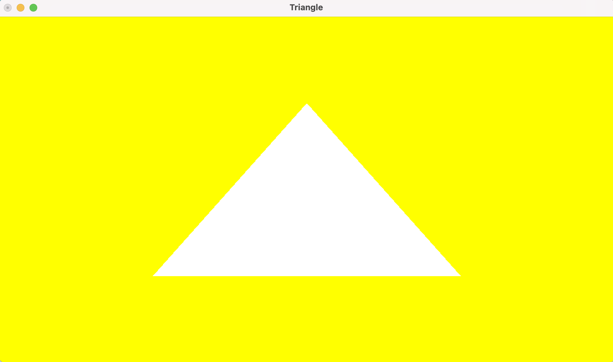

# Introduction à OpenGL/C++

2.a En commentant glClear(GL_COLOR_BUFFER_BIT), l'affichage est en noir et blanc
2.b En remplacant GLUT_SINGLE par GLUT_DOUBLE, le triangle disparait
2.c En remplacant maintenant glFlush() par glutSwapBuffers(), le triangle reapparait
