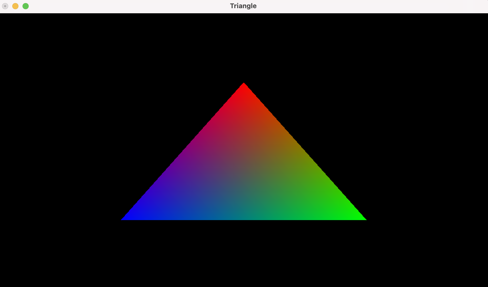
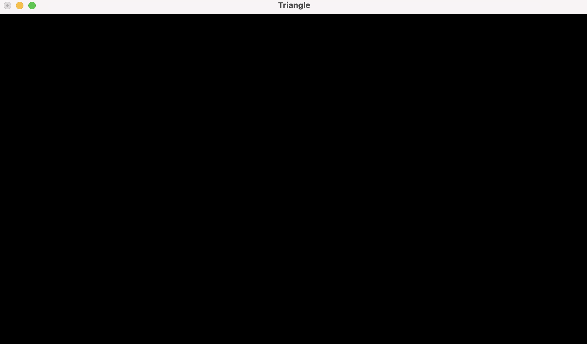
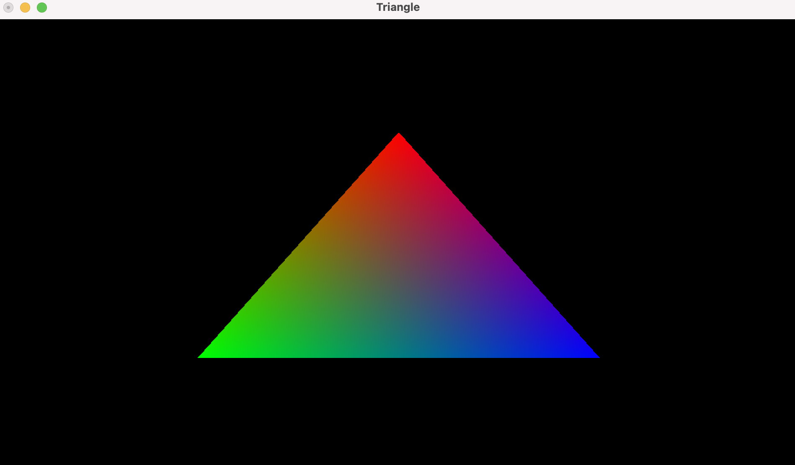
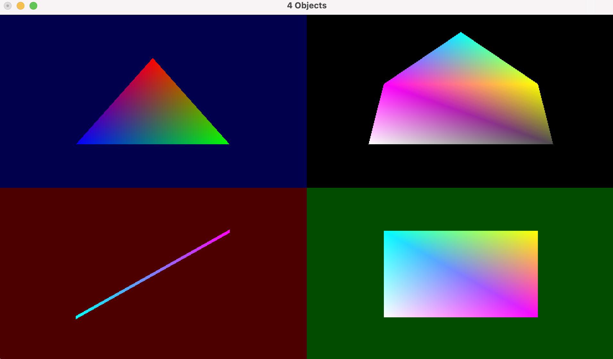
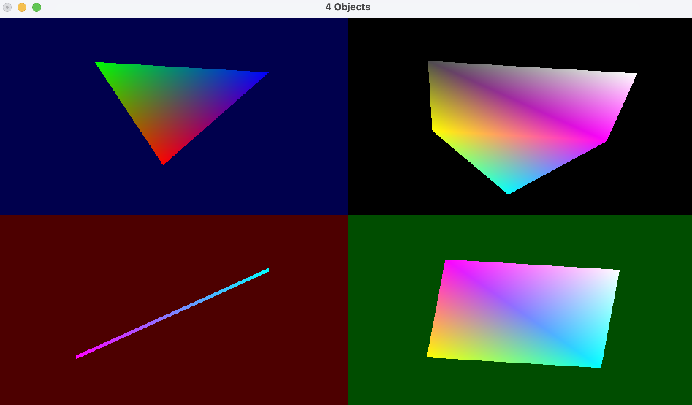
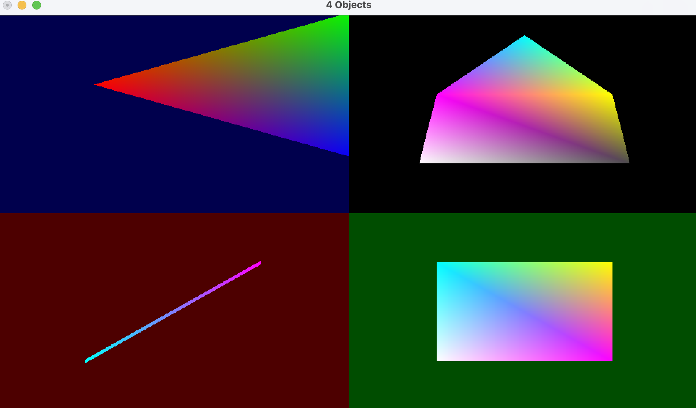
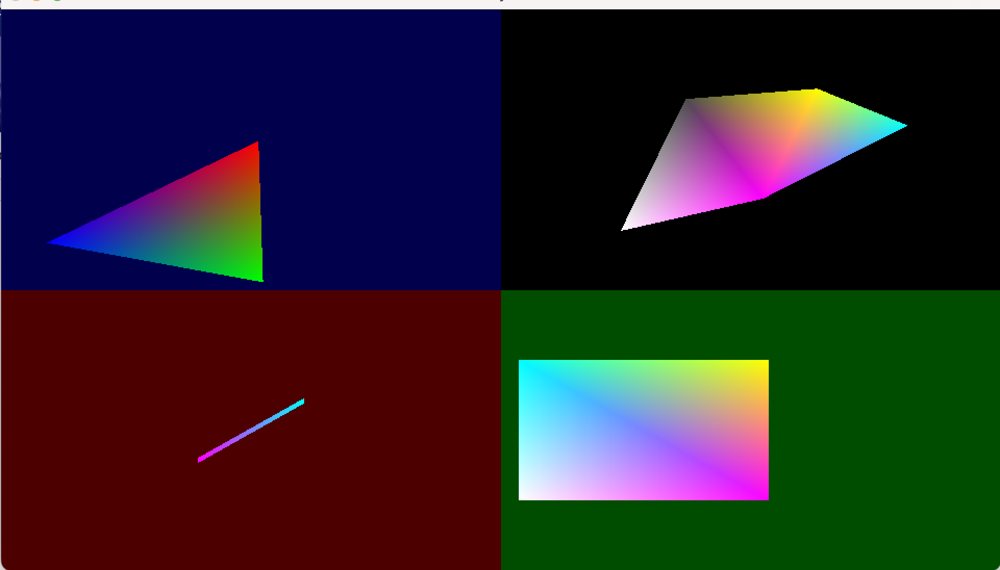
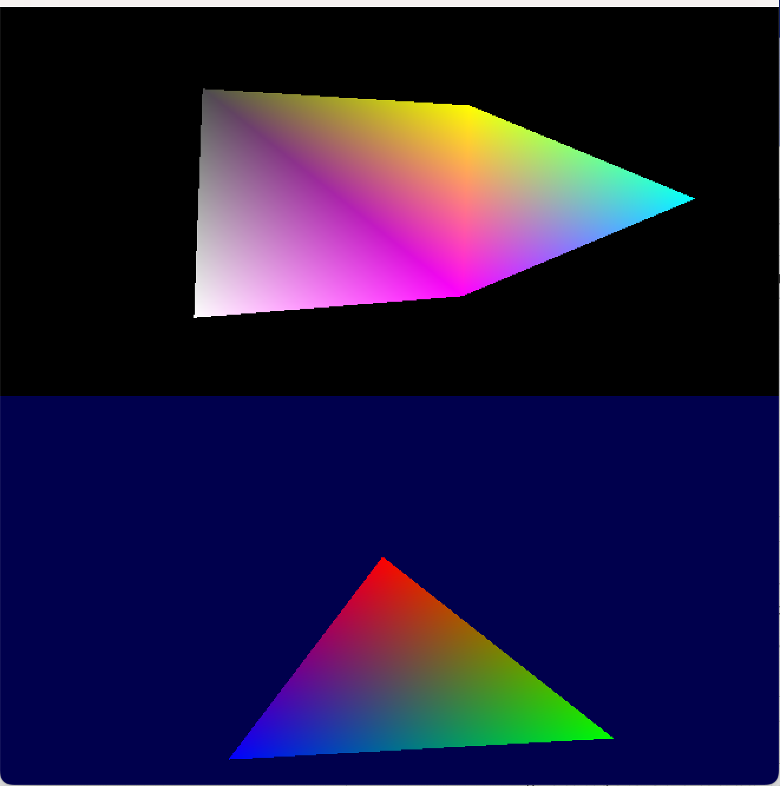

# Introduction à OpenGL – TD
Author : Xiumin LIN

CMD : `g++ -o main ex.cpp -framework OpenGL -framework GLUT`

## 1. Primitivess
Ex 1.1 : Attributs des primitives
Spécifiez des couleurs distinctes pour chaque sommet (par exemple, rouge pour le premier, vert pour le second, et bleu pour le troisième).

```cpp
glColor3ub(255, 0, 0);
glVertex2f(0.0f, 0.5f);

glColor3ub(0, 255, 0);
glVertex2f(0.5f, -0.5f);

glColor3ub(0, 0, 255);
glVertex2f(-0.5f, -0.5f);
```

Ex 1.2 : Orientation des primitives
Activez le ‘face culling’ et essayez d’inverser les sommets 2 et 3 de notre triangle.

<div style="display: flex;">
    
    
</div>

En activant le "face culling" en déclarant `glEnable(GL_CULL_FACE);` avant la définition des sommets de l'object, on peut spécifier les sommets de l'object dans le sens horaire.

## 2. Fenêtrage
Ex 2.1 : Créez 4 viewports de sorte à séparer la fenêtre en 4 parties distinctes. Chacun des viewports est effacé avec une couleur de fond différente. Affichez des primitives différentes dans chaque viewport (par ex, un triangle dans le viewport en haut à gauche, un ‘triangle-strip’ dans un autre, une ligne dans le troisième etc..


```cpp
// scissor bas gauche
glViewport(0, 0, scissorWidth, scissorHeight);
glScissor(0, 0, scissorWidth, scissorHeight);
glClearColor(DEFAULT_INTENSITY, 0.f, 0.f, DEFAULT_INTENSITY);
glClear(GL_COLOR_BUFFER_BIT);
glLineWidth(5.0f);

    glBegin(GL_LINES);
    glColor3f(0.0f, 1.0f, 1.0f); // Cyan
    glVertex3f(-0.5f, -0.5f, 0.0f);

    glColor3f(1.0f, 0.0f, 1.0f); // Purple
    glVertex3f(0.5f, 0.5f, 0.0f);
    glEnd();

glDisable(GL_SCISSOR_TEST);
```

## 3. Transformations
3.1. Matrices et transformation

Ex 3.1.a : Utilisez la fonction glRotatef(0.71f, 0.f, 0.f, 1.f) où 0.71f est une valeur angulaire, et (0,0,1) correspond à l’axe de rotation. Que remarquez-vous ?

```cpp
void Render()
{
    glRotatef(0.71f, 0.f, 0.f, 1.f);
    ...
}
```

On remarque que les formes tournent en continue.

Ex 3.1.b : Utilisez glLoadIdentity() de sorte à ce que le triangle soit tourné mais fixe.
```cpp
void Render()
{
    glLoadIdentity();
    glRotatef(0.71f, 0.f, 0.f, 1.f);
    ...
}
```
En ajoutant glLoadIdentity() avant la fonction rotate, cela permet d'annuler la transformation au appliqué précédamment, ce qui permet de fixer la rotation.

Ex 3.1.c : Utilisez les fonctions glScalef(), glTranslatef() et glRotatef() de sorte à ce que le triangle soit 1.5 fois plus grand, tourné vers la gauche -selon l’axe avant- et positionné sur la droite de l’écran.


3.2. Animation
Ex 3.2 : Utilisez le temps écoulé comme un facteur de l’angle de rotation, comme un facteur d’homothétie (scale) ou comme un facteur de déplacement.

```cpp
float secondsSinceStart = glutGet(GLUT_ELAPSED_TIME) / 1000.0;
float sinValue = sin(secondsSinceStart);

// Scale the object along all three axes by the value of sinValue
glScalef(sinValue, sinValue, sinValue);

// Translate the object along the x-axis by the value of sinValue
glTranslatef(sinValue, 0, 0);

// Rotate the object around the vector (1, 1, 1) by an angle of 20 * secondsSinceStart
glRotatef(20 * secondsSinceStart, 1.f, 1.f, 1.f);
```

3.3. Pile matricielle
Ex 3.3 : Sans utiliser glLoadIdentity(), affichez deux triangles, l’un à sa position ortho-centrée (comme dans l’exercice 1.1) et l’autre orienté comme dans l’exercice 3.2.

```cpp
glPushMatrix();
// glBegin() glEnd()
glPopMatrix();
```

